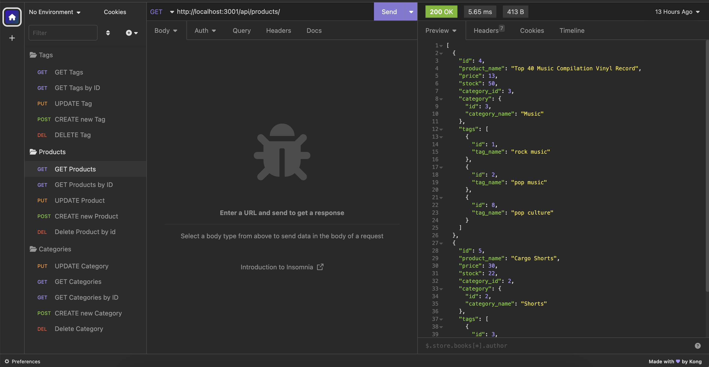

# E-commerce Back End

## Description

This back end application was built for ecommerce sites to keep track of their inventory from the categoies products belong to the tags associated with each product. This Node JS application utitilzes mySql through sequelize and runs its server through Express JS. 

## Table of Contents (Optional)

If your README is long, add a table of contents to make it easy for users to find what they need.

- [Installation](#installation)
- [Usage](#usage)
- [Credits](#credits)
- [License](#license)

## Installation

This application requires NodeJS and mySql. All other npm packages (sequelize, mysql2, express, dotenv) can be dowloaded following these steps by running 'npm i' in the application's root directory. To easily make our API calls that run GET, PUT, POST, and DELETE requests, we use Insomnia. So we recommend downloading this as well.

To get the application running, first install the npm packages as stated above. Create and use the ecommerce_db database by starting mysql and running the schema.sql file:
    `mysql -u -root -p`
    Enter your password...
    `SOURCE db/schema.sql;`
    Quit mysql
    `quit`

Then configure your config/connection.js file so sequelize can connect to your mySql database. Create a new .env file in the application's root directory and include the following information:
    `DB_NAME='ecommerce_db'`
    `DB_PW='your mysql password'`
    `DB_USER='your mysql username'`

The seeds/ folder contains .js with example data you can you use to populate your ecommerce_db database. Update these files with data relevant to your ecommerce site if you choose to do so. Seed your database with the command:
    `npm run seed`
If this runs without errors, you've successfully created the ecommerce_db and connected sequelize to your application.

To run the application, enter the command:
    `npm run start`
You will now be able to view, add, update, and delete categories, products, and tags in your ecommerce_db by runnning API calls in Insomnia. To quit the application run control-c in the application shell.

## Usage

After the set up steps described above and you've begun running the application, run the following Http requests in insomnia to use the application:
    Categories:
    - See all categories (GET): http://localhost:3001/api/categories
    - See a category by id (GET): http://localhost:3001/api/categories/id
    - Update a category by id (PUT): http://localhost:3001/api/categories/id
    - Create a new category (POST): http://localhost:3001/api/categories
    - Delete a category by id (DELETE): http://localhost:3001/api/categories/id
    - Use the following json format template when updating or creating a category:
        - `{"category_name": "Equipment"}`

    Products:
    - See all products (GET): http://localhost:3001/api/products
    - See a product by id (GET): http://localhost:3001/api/products/id
    - Update a product by id (PUT): http://localhost:3001/api/products/id
    - Create a new product (POST): http://localhost:3001/api/products
    - Delete a product by id (DELETE): http://localhost:3001/api/products/id
    - Use the following json format template when updating or creating a product:
        - `{
	        "product_name": "ProductName",
	        "price": 33.00,
	        "stock": 13,
	        "category_id": 1,
	        "tag_id": [3]
            }`

    Tags:
    - See all tags (GET): http://localhost:3001/api/tags
    - See a tag by id (GET): http://localhost:3001/api/tags/id
    - Update a tag by id (PUT): http://localhost:3001/api/tags/id
    - Create a new tag (POST): http://localhost:3001/api/tags
    - Delete a tag by id (DELETE): http://localhost:3001/api/tags/id
    - Use the following json format template when updating or creating a tag:
        - `{
            "tag_name": "Butterfly",
            "productIds": [4]
            }`

Provide instructions and examples for use. Include screenshots as needed.

To add a screenshot, create an `assets/images` folder in your repository and upload your screenshot to it. Then, using the relative filepath, add it to your README using the following syntax:

## Credits

sequelize: https://www.npmjs.com/package/sequelize
mysql2: https://www.npmjs.com/package/mysql2
dotenv: https://www.npmjs.com/package/dotenv
express: https://www.npmjs.com/package/express

## License

MIT license